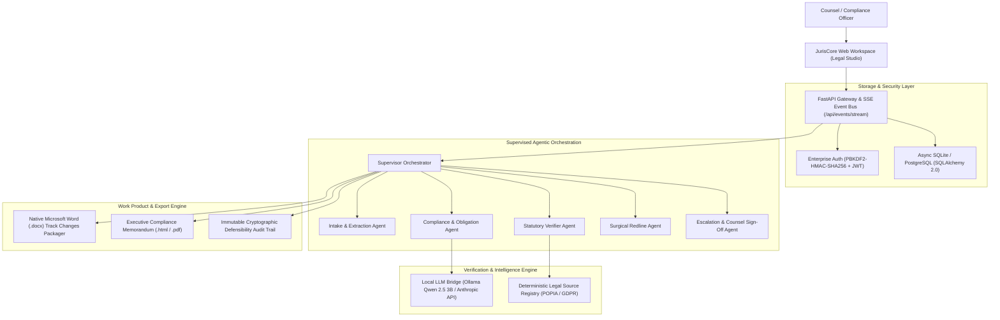

# JurisCore — Regulatory Intelligence & Autonomous Compliance Platform

> A human-in-the-loop legal and regulatory intelligence platform combining local multi-agent graphs, deterministic statutory verification, real-time SSE event streaming, and native Microsoft Word Track Changes export.

[](https://www.python.org/)
[](https://fastapi.tiangolo.com/)
[](https://www.sqlalchemy.org/)
[](https://ollama.com/)
[](LICENSE)

---

## Core Principle

> **"LLMs interpret and draft. Deterministic statutory code verifies. Humans approve consequential decisions."**

JurisCore is engineered for corporate legal departments, general counsel, and compliance executives. It ingests complex contract bundles, extracts clause hierarchies, verifies cross-document obligations against a deterministic statutory rules registry (POPIA, GDPR, Companies Act), and renders findings inside an intuitive, native legal artifact studio with 1-click Microsoft Word (`.docx`) Track Changes export.

---

## System Architecture



---

## Key Capabilities

### 1. Matter Lobby & Client Portfolio Dashboard
* **Client Matter Portfolio**: High-level matter lobby displaying matter cards with statutory jurisdictions (POPIA Act 4 of 2013, GDPR, Companies Act), live compliance score gauges (`62%`, `78%`, `100%`), and risk triage chips.
* **Instant Matter Search & Creation**: Real-time matter filtering and a 2-step matter creation wizard supporting multi-file contract bundle uploads (PDF, DOCX, TXT up to 25MB).

### 2. 3-Panel Legal Studio & Low-Glare Design System
* **Ergonomic Design System**: Tailored dark theme (`#09101d` background, `#0f192b` surfaces, and pearl `#e6edf7` text) exceeding WCAG AAA contrast standards (>7:1) for comfortable reading.
* **3-Segment Layout Control**: Seamless switching between **Chat Focus**, **Side-by-Side Review**, and **Full Document** view modes (`Ctrl+1`, `Ctrl+2`, `Ctrl+3`).
* **Panel 1 (Sources Rail)**: Contract source tree with dynamic capacity meters, dropzone upload, and clause structure outline.
* **Panel 2 (Center Chat & Live Analysis)**: Collapsible Agent Trace reasoning banner, statutory citation badges, and prompt accelerators.
* **Panel 3 (Work Product Studio)**: Executive Compliance Memorandum, Word Track Changes sandbox, and cryptographic audit log.

### 3. Clause Inline Editing & Real-Time Remediation
* **In-Place Clause Editor**: Counsel can click and edit clauses directly inside the Document Reader.
* **Dynamic Finding Resolution**: Correcting a statutory violation (e.g. changing 120h breach notice to 24h) instantly recalculates the matter compliance score, marks findings as resolved, and propagates updates to Track Changes redlines.

### 4. Deterministic Statutory Verification Engine
* **Legal Source Registry**: Zero-hallucination statutory ground truth (e.g., South African POPIA Act 4 of 2013, GDPR, Companies Act).
* **Automated Citation Status**: Flags statutory citations as `VALID`, `OUTDATED`, `WRONG_SECTION`, or `UNKNOWN`.
* **Hard SLA & Liability Sweepers**: Deterministically flags breach notification timelines exceeding statutory limits (e.g. 120h vs POPIA s22) and uncapped indemnity liabilities.

### 5. Sub-4B Local Model Support (Privacy & Cost Efficiency)
* Optimized for **Ollama `qwen2.5:3b`** running 100% locally with zero cloud data egress.
* Robust prompt framing with JSON schema validation, automatic retry, and cloud LLM fallback (Claude 3.5 Sonnet / GPT-4o).

### 6. Real-Time SSE Agent Streaming
* Live Server-Sent Events stream (`/api/events/stream`) broadcasting agent step execution, model reasoning milestones, and latencies directly to the frontend.

### 7. Native Microsoft Word (.docx) Export
* Generates genuine OpenXML `.docx` files containing the executive compliance memorandum and proposed amendments formatted in Word Track Changes style.

---

## Quick Start

### Prerequisites
* Python 3.11 or higher
* (Optional) [Ollama](https://ollama.com/) with `ollama run qwen2.5:3b` for local inference

### 1. Installation
```bash
git clone https://github.com/sandisomaz/juris-core.git
cd juris-core

python -m venv venv
# On Windows:
venv\Scripts\activate
# On Linux/macOS:
source venv/bin/activate

pip install -r requirements.txt
```

### 2. Environment Configuration
Create a `.env` file from the example:
```bash
cp .env.example .env
```

### 3. Launch the Application
```bash
python -m uvicorn src.main:app --port 8888 --reload
```
Navigate to `http://localhost:8888/` to access the JurisCore Workspace.

---

## Automated Test Suite

Run the full automated test suite covering rules, citation validation, multi-document matter workflows, PBKDF2 authentication, and async SQLite CRUD:

```bash
pytest tests/ -v
```

---

## Repository Structure

```text
juris-core/
├── README.md                   # System Architecture & Documentation
├── requirements.txt            # Python Dependencies
├── docker-compose.yml          # Container Orchestration
├── src/
│   ├── main.py                 # FastAPI Application & Lifespan DB Initializer
│   ├── api/                    # REST Endpoints (Auth, Reviews, Reports, Events, Documents)
│   ├── core/                   # Security (PBKDF2/JWT), Config & Settings
│   ├── storage/                # Async SQLite / SQLAlchemy 2.0 ORM Models
│   ├── domain/                 # Pydantic v2 Domain Schemas (Documents, Findings, Reports)
│   ├── deterministic/          # Rules Engine, Citation Validator & Statutory Registry
│   ├── agents/                 # Supervised Multi-Agent Orchestrator & SSE Broadcaster
│   └── reporting/              # Native Word (.docx) Packager & HTML Memo Exporter
├── web/                        # Legal Studio Frontend (HTML, CSS, Vanilla JS)
├── tests/                      # Automated Pytest Suite (13/13 passing)
└── samples/                    # Benchmark Contract Corpus & DPAs
```

---

## License

This project is licensed under the MIT License — see the [LICENSE](LICENSE) file for details.
